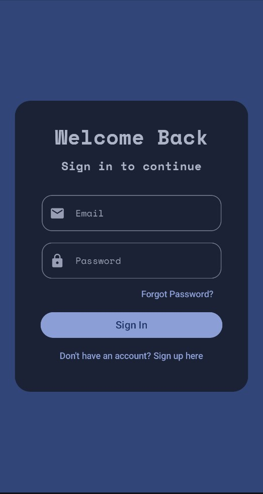
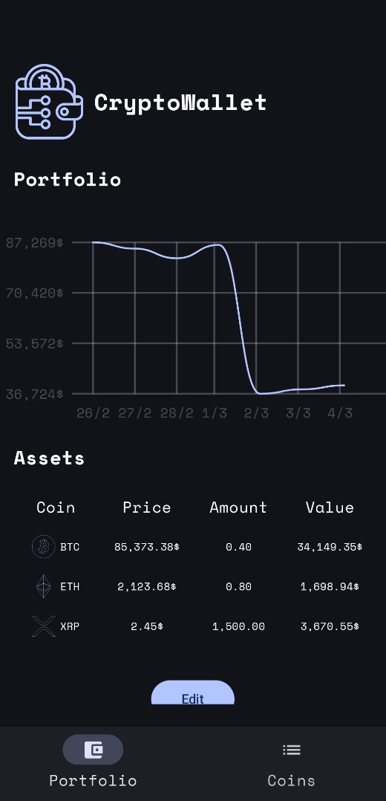
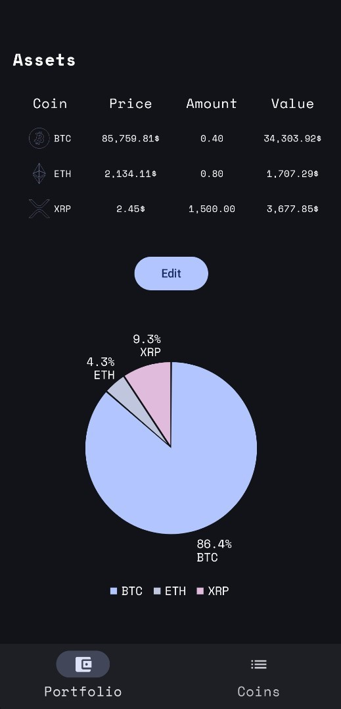
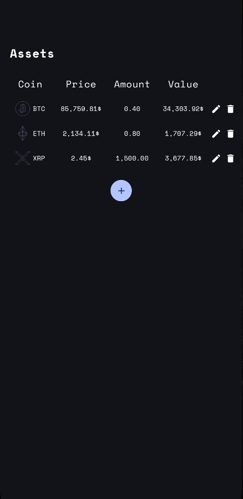
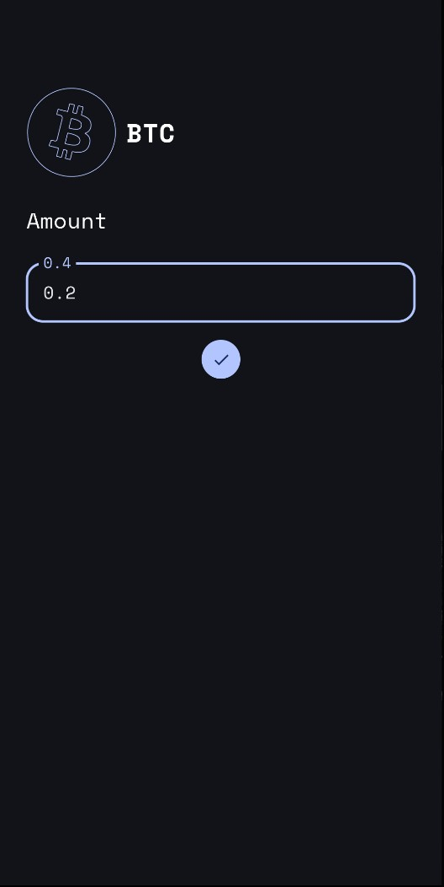
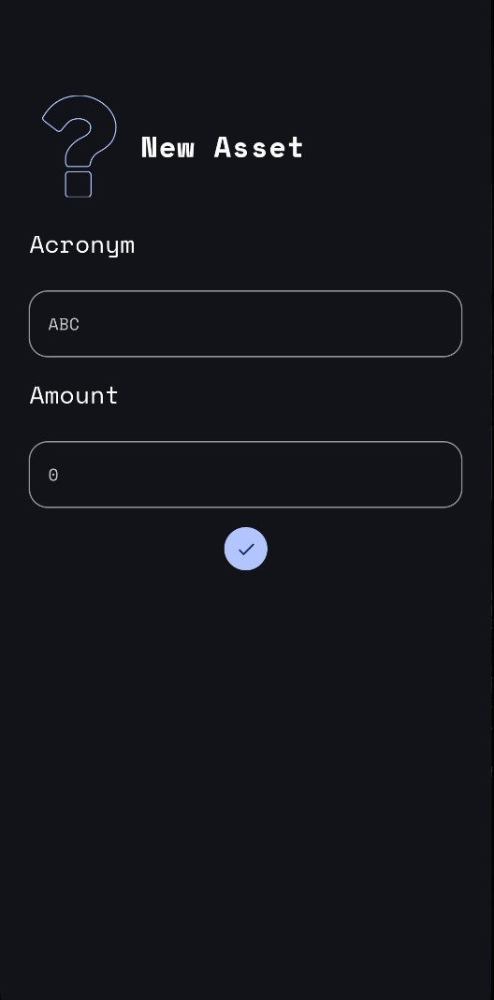
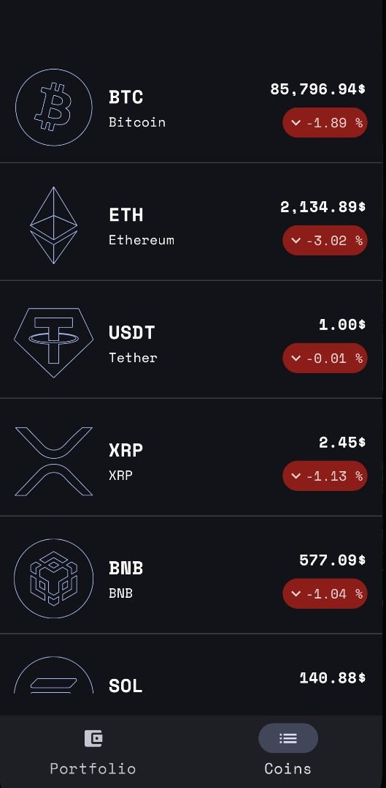
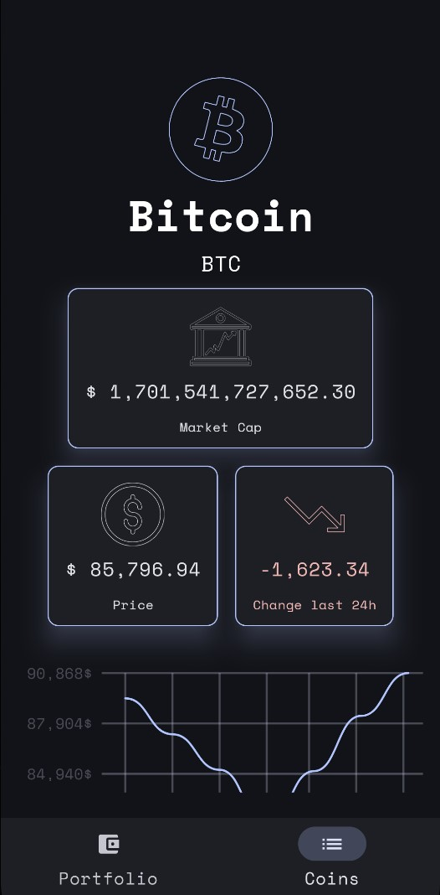
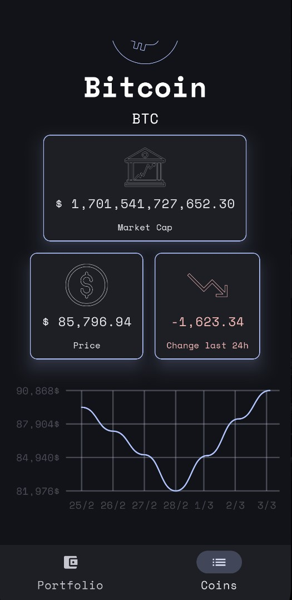

# Overview
Mobile app in Kotlin to manage your crypto portfolio and check the situtation on crypto markets

# Views
## Login and main portfolio view

    
   
    

## Assets management views

    
   
    

## Crypto market views

    
   
    

